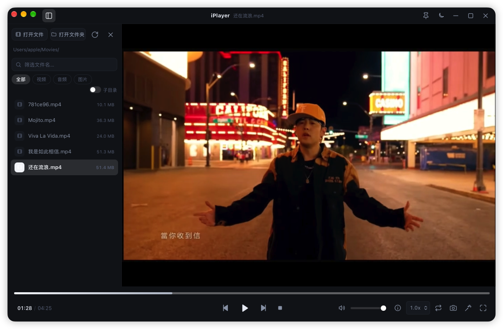

<div align="center">

# iPlayer

基于 **Rust + Tauri v2** 的桌面视频播放器。

  

</div>

## 功能特性

| 需求 | 实现 |
| --- | --- |
| 主流音视频与图片格式 | WebKit 原生格式直接播放；MKV / AVI / WMV / FLV / RMVB / TS 等通过内置 **ffmpeg sidecar** 自动处理；JPG / PNG / GIF / WebP / BMP / SVG / AVIF 等图片直接查看 |
| 慢格式边转码边播放 | 必须重新编码的片子（WMV / MPEG / DivX / Hi10P…）**打开约 1～2 秒即开始播放**，后台持续转码；拖动进度条会从新位置重新起转，不再等待整段转换，也不占磁盘 |
| 切换文件即时让路 | 转码途中点开另一个文件，正在跑的编码器**立刻停止**、半成品不会残留，新文件按自己的方式（直接播 / 转封装 / 边转码边播）立即接手，不会卡在前一个文件上 |
| 左侧文件列表 | 自动扫描当前文件夹内的可播放文件，支持包含子目录、文件名筛选、类型过滤，可一键收起/展开（`Ctrl/⌘ + B`） |
| 底部控制条 | 固定在最下方、完全不透明：播放/暂停、上一个/下一个、进度拖拽（带时间预览）、音量、倍速、循环 |
| 主题 | 默认深色，可在设置或控制条切换「跟随系统 / 浅色 / 深色」，窗口原生外观同步变化（`Ctrl/⌘ + T` 循环切换） |
| 截图 / 音频 / GIF | 当前帧截图 PNG；提取音频为 M4A / MP3 / WAV / FLAC / 原样复制；任意时间区间转 GIF（自动调色板 + 抖动优化） |
| 窗口 | 固定窗口大小开关、画面四种自适应方式（适应/铺满/拉伸/原始尺寸）、窗口置顶（前置显示） |



### 快捷键

| 按键 | 功能 | 按键 | 功能 |
| --- | --- | --- | --- |
| `空格` / `K` | 播放 / 暂停 | `←` / `→` | 快退 / 快进 5s（`Shift` 1s） |
| `↑` / `↓` | 音量 ±5% | `M` | 静音 |
| `F` | 全屏 | `S` | 截图 |
| `G` | GIF 工具箱 | `I` | 媒体信息 |
| `N` / `P` | 下一个 / 上一个 | `[` / `]` | 减速 / 加速（0.5x 步进） |
| `Ctrl/⌘ + B` | 收起/展开文件列表 | `Ctrl/⌘ + T` | 切换主题 |
| `Ctrl/⌘ + .` | 停止 | `Esc` | 关闭弹窗 |

## 目录结构

```
├── docs/                 # README 截图等文档资源
├── src/                  # 前端（原生 HTML/CSS/JS，无构建步骤）
│   ├── index.html
│   ├── styles.css
│   ├── icons.js          # 内联 SVG 图标
│   ├── assets/           # 空状态页 logo
│   ├── viz.js            # 音乐均衡器可视化
│   ├── stream.js         # 边转码边播放（MediaSource 喂流）
│   └── app.js            # 播放器逻辑
├── src-tauri/
│   ├── tauri.conf.json
│   ├── capabilities/     # 权限配置
│   ├── binaries/         # ffmpeg / ffprobe sidecar
│   ├── icons/            # 应用图标（scripts/make-icons.py 生成）
│   └── src/
│       ├── lib.rs        # 入口 & 命令注册
│       ├── commands.rs   # Tauri 命令
│       ├── ffmpeg.rs     # sidecar 定位与进度流式解析
│       ├── stream.rs     # 边转码边播放的会话与管道
│       └── media.rs      # 文件扫描 / ffprobe 探测 / 播放规划
└── scripts/              # 图标生成 & sidecar 获取脚本
```

## 开发

```bash
npm install            # 安装 Tauri CLI
npm run fetch:sidecar  # 准备 ffmpeg / ffprobe 二进制到 src-tauri/binaries
npm run dev            # 开发模式
npm run build          # 当前平台一键打包（详见下方「打包」）
```

## 打包

```bash
npm run build:mac            # macOS（Apple Silicon）
npm run build:mac:universal  # macOS 通用版（Intel + Apple Silicon）
npm run build:win            # Windows（.exe / .msi）
npm run build:linux          # Linux（.deb / .rpm / .AppImage）
```

产物在 `src-tauri/target/<目标三元组>/release/bundle/`。

## 许可证

[MIT](LICENSE)
